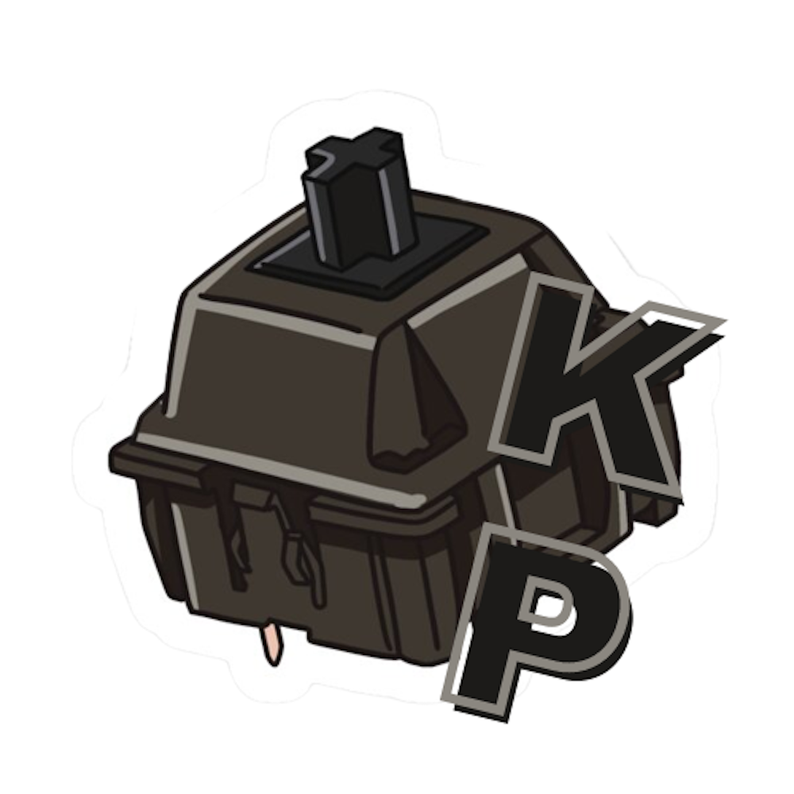

<!--
*** Thanks for checking out the Best-README-Template. If you have a suggestion
*** that would make this better, please fork the repo and create a pull request
*** or simply open an issue with the tag "enhancement".
*** Don't forget to give the project a star!
*** Thanks again! Now go create something AMAZING! :D
-->

<!-- PROJECT SHIELDS -->
<!--
*** I'm using markdown "reference style" links for readability.
*** Reference links are enclosed in brackets [ ] instead of parentheses ( ).
*** See the bottom of this document for the declaration of the reference variables
*** for contributors-url, forks-url, etc. This is an optional, concise syntax you may use.
*** https://www.markdownguide.org/basic-syntax/#reference-style-links
-->

[![Status][website-shield]][website-url]
[![Github][github-shield]][github-url]
[![Instagram][instagram-shield]][instagram-url]
[![Youtube][youtube-shield]][youtube-url]
[![LinkedIn][linkedin-shield]][linkedin-url]
[![Gmail][gmail-shield]][gmail-url]

<!-- PROJECT LOGO -->
 

  

<h3 align="center">Keyphon</h3>

  

    A keyboard company
     
    <a href="https://github.com/tokazakiuw/keyphon"><strong>Explore the docs »</strong></a>
     
     
    <a href="https://github.com/tokazakiuw/keyphon">View Demo</a>
    ·
    <a href="https://github.com/tokazakiuw/keyphon/issues">Report Bug</a>
    ·
    <a href="https://github.com/tokazakiuw/keyphon/issues">Request Feature</a>
  

<!-- TABLE OF CONTENTS -->

  
Table of Contents

  <ol>
    <li>
      <a href="#about-the-project">About The Project</a>
      <ul>
        <li><a href="#built-with">Built With</a></li>
      </ul>
    </li>
    <li>
      <a href="#getting-started">Getting Started</a>
      <ul>
        <li><a href="#prerequisites">Prerequisites</a></li>
        <li><a href="#installation">Installation</a></li>
      </ul>
    </li>
    <li><a href="#usage">Usage</a></li>
    <li><a href="#roadmap">Roadmap</a></li>
    <li><a href="#license">License</a></li>
    <li><a href="#contact">Contact</a></li>
    <li><a href="#acknowledgments">Acknowledgments</a></li>
  </ol>

<!-- ABOUT THE PROJECT -->
## About The Project

[![Product Name Screen Shot][product-screenshot]](https://example.com)

Here's a blank template to get started: To avoid retyping too much info. Do a search and replace with your text editor for the following: `github_username`, `repo_name`, `twitter_handle`, `linkedin_username`, `email_client`, `email`, `project_title`, `project_description`

(<a href="#top">back to top</a>)

### Built With

* [HTML]
* [CSS]
* [SASS](https://sass-lang.com/)
* [JavaScript](https://www.javascript.com/)
* [PHP](https://www.javascript.com/)
* [Bootstrap](https://getbootstrap.com)
* [JQuery](https://jquery.com)

(<a href="#top">back to top</a>)

<!-- ROADMAP -->
## Roadmap

- [ ] Feature 1
- [ ] Feature 2
- [ ] Feature 3
    - [ ] Nested Feature

See the [open issues](https://github.com/tokazakiuw/keyphon/issues) for a full list of proposed features (and known issues).

(<a href="#top">back to top</a>)

<!-- LICENSE -->
## License

Distributed under the MIT License. See `LICENSE.txt` for more information.

(<a href="#top">back to top</a>)

<!-- CONTACT -->
## Contact

Your Name - [@twitter_handle](https://twitter.com/twitter_handle) - email@email_client.com

Project Link: [https://github.com/tokazakiuw/keyphon](https://github.com/tokazakiuw/keyphon)

(<a href="#top">back to top</a>)

<!-- ACKNOWLEDGMENTS -->
## Acknowledgments

* [Best-README-Template](https://github.com/othneildrew/Best-README-Template)
* [Choose an Open Source License](https://choosealicense.com)
* [Font Awesome](https://fontawesome.com)

(<a href="#top">back to top</a>)

<!-- MARKDOWN LINKS & IMAGES -->
<!-- https://www.markdownguide.org/basic-syntax/#reference-style-links -->
[website-shield]: https://img.shields.io/website?down_color=red&down_message=offline&up_color=green&up_message=online&url=https%3A%2F%2Fkeyphon.com
[website-url]: https://keyphon.com
[github-shield]: https://img.shields.io/badge/-GitHub-black.svg?style=for-the-badge&logo=github&colorB=555
[github-url]: https://github.com/tokazakiuw
[instagram-shield]: https://img.shields.io/badge/-Instagram-black.svg?style=for-the-badge&logo=instagram&colorB=555
[instagram-url]: https://www.instagram.com/keyphon/?hl=en
[youtube-shield]: https://img.shields.io/badge/-Youtube-black.svg?style=for-the-badge&logo=youtube&colorB=555
[youtube-url]: https://www.youtube.com/keyphon/?hl=en
[linkedin-shield]: https://img.shields.io/badge/-LinkedIn-black.svg?style=for-the-badge&logo=linkedin&colorB=555
[linkedin-url]: https://www.linkedin.com/in/tyokazaki
[gmail-shield]: https://img.shields.io/badge/-Gmail-black.svg?style=for-the-badge&logo=gmail&colorB=555
[gmail-url]: mailto:keyphon@gmail.com
[product-screenshot]: images/screenshot.png